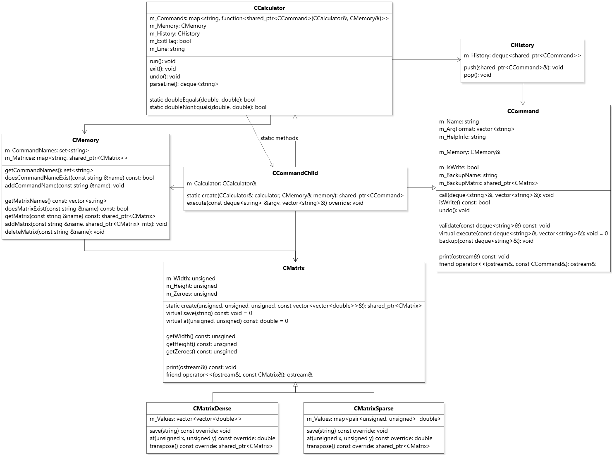

# Maticová kalkulačka
Naprogramuju maticovou kalkulačku, podporující několik maticových operací. Komunikace uživatele bude realizována přes terminál.

## Zadání z Progtestu
Vytvořte aplikaci implementující maticovou kalkulačku.

Kalkulačka musí implementovat:

1. práci s maticemi různé velikosti
2. základní operace: sčítání, odčítání, násobení, transpozice
3. sloučení (3x3 sloučeno s 3x3 => matice 6x3) a oříznutí (např. pouze levá polovina matice 6x3 => levá 3x3)
4. pro čtvercové matice navíc výpočet inverze
5. efektivní paměťovou reprezentaci (pro řídké matice se nehodí 2D pole, pro husté matice naopak)
6. funkce pro výpočet determinantu, určení hodnosti, Gaussova eliminační metoda
7. proměnné (uložení matice do proměnné, načítání matice ze vstupu, využití proměnné ve výpočtu)
8. uložení matice (v efektivní reprezentaci) do souboru a její načtení ze souboru

## Vlastní implementace
Kalkulačka má implementováno:

1. práce s maticemi různé velikosti
2. základní operace: sčítání, odčítání, násobení, transpozice `CAdd, CSub, CMul, CTrans`
3. horizontální sloučení `CMerge` a oříznutí `CCut`
4. pro čtvercové matice navíc výpočet inverze `CInv`
5. efektivní paměťová reprezentace `CMatrix, CMatrixDense, CMatrixSparse`
6. funkce pro výpočet determinantu, určení hodnosti, Gaussova eliminační metoda `CDet, CRank, CGem`
7. proměnné, uložení matice do proměnné, načítání matice ze vstupu `CScan`, využití proměnné ve výpočtu
8. uložení matice v efektivní reprezentaci do souboru a její načtení ze souboru `CSave, CLoad`

Rozšíření zadání:

9. výpočet adjungované matice `CAdj`
10. zrušení vykonání posledního příkazu `CUndo, CHistory`

## Polymorfismus
Polymorfismus je aplikovaný v:
* **Typy matic, husté a řídké**
* Třídy `CMatrixDense` a `CMatrixSparse` se dědí od rodiče `CMatrix`, táto hierarchie je vytvořena pro
  efektivní paměťovou reprezentaci matic. `CMatrixDense` chrání všechny hodnoty v double vectoru hodnot, ale
  `CMatrixSparse` může mít hodně nulových hodnot, proto chrání jenom nenulové hodnoty v mapě s
  klíčem souřadnice.

* **Command Pattern, hierarchie příkazů**
* Ten návrh byl inspirován popisem Command Patternu ze zdroje:
  `https://refactoring.guru/design-patterns/command`
* V mém projektu Client a Receiver reprezentovány třídy `CCalculator` a `CMemory`. Client čte požadavky
  uživatele ze vstupu a z nich vytvoří instanci příkazů, které pak jsou vykonány a unikátně získává/mění
  data v Receiveru (podtřídy `CCommand` implementují polymorfní metodu execute). Příkazy se ukládají do `CHistory` bufferu. Pomocí této uložené sekvence lze snadno
  implementovat příkaz `CUndo`.

## Připomínky k použití programu
1. žádné argumenty ze vstupu uživatele nesmí se začínat symbolem `~` (takové názvy
argumentů jsou rezervovány pro volání příkazů jinými příkazy, aby pak oni nepřepisovali proměnné, využité uživatelem)
2. proměnné matic nesmí se jmenovat jako názvy dostupných příkazů
3. EOF při načítání příkazu nebo matice ze vstupu ukončí program
4. soubor s uloženou matici nesmí mít žádné whitespacy po poslední očekávané hodnotě, jinak načtení ze souboru selže (ostatní whitespacy jsou ignorovany)

## Diagram tříd

   

## Dostupné příkazy
        * [RESULT] [VARIABLE] [VARIABLE] 
                multiply two matrices and save to the result variable
                
        + [RESULT] [VARIABLE] [VARIABLE]
                add two matrices and save to the result variable

        - [RESULT] [VARIABLE] [VARIABLE]
                subtract two matrices and save to the result variable

        T [RESULT] [VARIABLE]
                transpose given matrix and save to the result variable

        adj [RESULT] [VARIABLE]
                calculate the adjugate of a given square matrix

        cut [RESULT] [VARIABLE] [WIDTH] [HEIGHT] [X] [Y]
                cut matrix of desired dimensions from given matrix, starting from the given coordinates

        del [VARIABLE]
                delete matrix in a given variable

        det [VARIABLE]
                return the determinant of a given matrix

        exit
                close the program

        gem [RESULT] [VARIABLE]
                perform Gaussian elimination on a given variable and save to the result
                
        help
                print information about all available commands

        help-cmd [COMMAND]
                print information about given command

        inv [RESULT] [VARIABLE]
                calculate the inverse of a given square matrix

        load [RESULT] [PATH-R]
                read and load matrix from given path

        merge [RESULT] [VARIABLE] [VARIABLE]
                merge two matrices in one horizontally

        print [VARIABLE]
                print matrix stored in given variable

        rank [VARIABLE]
                return the rank of a given matrix

        save [VARIABLE] [PATH-W]
                save matrix in the file in given path

        scan [RESULT] [WIDTH] [HEIGHT]
                scan the matrix of given dimensions from the input stream

        undo
                return program's memory to the previous state

        vars
                print all stored variables

`